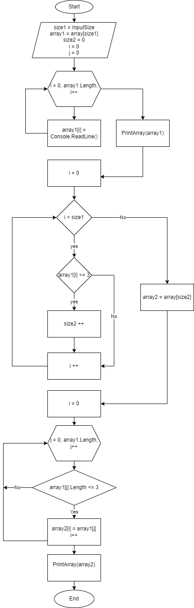

# Final_work
Итоговая проверочная работа
Написать программу, которая из имеющегося массива строк формирует массив из строк, длина которых меньше либо равноа 3 символа.
Первоначальный массив можно ввести с клавиатуры, либо задать на старте выполнения алгоритма.
При решении не рекомендуется пользоваться коллекциями, лучше обойтись исключительно массивами. 

Пример: 
["hello", "2", "world", ":-)"] -> ["2", ":-)"]

Структура программы: 
1. Ввод размера исходного массива с клавиатуры. Метод InputSize 
2. Создание массива1 указанного размера
2. Заполнение массива1 строковыми значениями с клавиатуры. Метод FillArray1
3. Вывод массива1 на печать. Метод PrintArray
4. Определение размера производного массива, где размер будет равен количеству элементов массива, в которых количество символов меньше либо равно 3. Метод FindArray2Size
5. Создание массива2 с размером, получившимся в результате выполнения метода FindArray2Size
6. Заполнение массива2 элементами из массива1, длина которых меньше либо равна 3. Метод FillArray2 
7. Вывод массива2 на печать. Метод PrintArray

Блок-схема алгоритма: 

